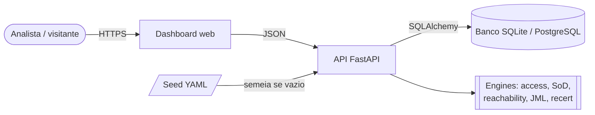

# iam-governance-lab

[](https://github.com/JulianoVinceCampos/iam-governance-lab-web/actions/workflows/ci.yml)
[](https://github.com/JulianoVinceCampos/iam-governance-lab-web/actions/workflows/codeql.yml)

[](LICENSE)

**[Demo ao vivo](https://iam-governance-lab-web.onrender.com)** — instância pública, dados
sintéticos, read-only. Pode levar alguns segundos para responder se estiver hibernando.

Governança de acesso IAM/IGA **read-only** sobre dados sintéticos multi-conta. O motor lê um
dataset, pontua o risco e reporta; nunca escreve num store de identidades real. Acompanha um
dashboard web interativo e um editor de cenários persistido em banco.

Responde as quatro perguntas que uma revisão de acesso de verdade faz:

- **Segregation of Duties**: quem carrega uma combinação tóxica de deveres, e isso veio de
  grant direto ou herdado por nesting de grupo?
- **Privilege reachability**: quem consegue *alcançar* um privilégio sensível, atravessando
  fronteira de conta, e por qual caminho exato?
- **Lifecycle (JML)**: qual acesso é resíduo de troca de função (privilege creep), é de um
  leaver, ou está dormante?
- **Recertification**: diante disso, o que revogar, pior primeiro, com um score explicável?

> Dados fictícios, criados para exercitar cada control. Ver [`data/`](data/).

Novo em IAM, IGA, RBAC ou ABAC? O que cada conceito é, por que está aqui e a intenção do
projeto estão em [docs/conceitos.md](docs/conceitos.md).

## Sumário

- [Destaques](#destaques)
- [Arquitetura](#arquitetura)
- [Como rodar](#como-rodar)
- [O dashboard](#o-dashboard)
- [Deploy](#deploy)
- [Testes e quality gates](#testes-e-quality-gates)
- [Estrutura do projeto](#estrutura-do-projeto)
- [Documentação](#documentação)

## Destaques

| Capacidade | O que entrega |
| --- | --- |
| Findings rastreáveis | Cada violação de SoD nomeia os dois entitlements e a cadeia de grupos que os trouxe; cada escalonamento imprime o caminho inteiro, aresta por aresta. |
| Score explicável | O risk score de recertification é uma fórmula documentada, termo a termo, não uma caixa-preta. |
| Escopo honesto | O que o modelo não avalia (condition keys, SCPs, deny) está escrito antes de qualquer conclusão. |
| RBAC e ABAC lado a lado | O acesso é resolvido pelos dois mecanismos reais: grupo (RBAC) e atributo (ABAC). Cada finding diz de qual veio, e o grafo pinta um em teal e o outro em azul. |
| Editor de cenários | Cria, edita e remove objetos pelo browser; toda edição é validada e recalcula os findings na hora. |
| Restore em um clique | O dataset vive em banco e se semeia de YAML; um botão reconstrói tudo, então um demo público sempre se recupera. |
| Deploy em container | Uma imagem, um volume; sobe atrás de um DNS com TLS via reverse proxy. |

## Arquitetura

Visão de contexto (diagramas C4 completos e de sequência em
[docs/arquitetura.md](docs/arquitetura.md)):



Três decisões que atravessam o projeto:

- **Standing access e reachable access são noções separadas.** SoD e recertification usam
  standing access (grants diretos mais o fecho transitivo de grupos). Reachability soma as
  arestas de assume-role e calcula o que se obtém escalando. Misturar esconde o risco.
- **Trust é modelado por conta.** A aresta de assume só existe quando o lado identity-based
  (o entitlement lista o role) e o resource-based (o role confia na conta, ou em `*`)
  concordam, espelhando o `sts:AssumeRole`.
- **O dataset valida antes de computar.** Referência inexistente, id duplicado e ciclo de
  nesting falham no load, então dataset quebrado nunca produz finding calado e errado.

## Como rodar

Requer Python 3.11+.

```bash
python -m venv .venv
# Windows:  .venv\Scripts\activate
# Unix:     source .venv/bin/activate
pip install -e ".[dev]"

iamgov validate --data data          # valida o dataset
iamgov scan --data data              # headline metrics em JSON
iamgov report --data data --out out  # gera governance.report.{json,md}
iamgov serve --data data             # sobe API + dashboard em http://127.0.0.1:8000
```

No Windows sem `make`, use o Python do venv direto: `.venv\Scripts\python.exe -m iamgov.cli serve`.

Na primeira subida o app cria um SQLite (`iamgov.db`) e o semeia com o YAML de `data/`.

## O dashboard

| View | Conteúdo |
| --- | --- |
| Visão geral | Cards de headline, SoD por severidade, gráfico de findings e os caminhos de escalonamento cross-account. |
| Grafo de privilégio | O grafo de acesso inteiro (Cytoscape.js). Escolha um target e uma identity, clique em *Traçar caminho*, e a rota de escalonamento fica destacada e descrita passo a passo. |
| Violações de SoD | Cada violação com procedência por match e onde consertar (identity ou grupo). |
| Lifecycle (JML) | Privilege creep, orphaned access, dormancy e joiner gaps. |
| Recertification | A worklist de revogação e as campanhas por reviewer. |
| Identities | Cada principal com status e footprint de acesso, filtrável. |
| Editor de dados | CRUD de accounts, entitlements, groups, roles, identities e regras de SoD, com validação de integridade e **Restore defaults**. |

## Deploy

Um único container; o estado é um arquivo SQLite num volume, semeado pelo YAML embutido.

```bash
docker compose up --build      # abre http://localhost:8000
```

Para um DNS público, o repositório traz um blueprint de Render (`render.yaml`) com auto-deploy
no push. A topologia, o caminho do commit até o ar, as variáveis de ambiente e a opção de auth
só na escrita estão em [docs/deploy.md](docs/deploy.md).

A instância pública deste repositório roda em
[iam-governance-lab-web.onrender.com](https://iam-governance-lab-web.onrender.com), com deploy
automático a cada push na `main`.

## Testes e quality gates

```bash
ruff check src tests    # lint
mypy                    # type check strict
pytest                  # testes de unidade + API
pip-audit               # CVE conhecido nas dependências
semgrep scan --config p/python --config p/security-audit src   # SAST
```

Duas camadas de teste: um dataset mínimo montado em código com respostas calculadas à mão
(regressão de engine falha localizada) e asserts que travam os números do dataset publicado
(mudança no seed passa a ser intencional). Sobre os testes rodam ainda duas frentes de
segurança: SAST com Semgrep e CodeQL, e auditoria de dependências com pip-audit, com o
Dependabot abrindo os PRs de bump. O CI roda os gates de qualidade em Python 3.11 a 3.13,
builda a imagem e a sobe para bater no health. Detalhe em [docs/ci-cd.md](docs/ci-cd.md) e a
política em [SECURITY.md](SECURITY.md).

## Estrutura do projeto

```
src/iamgov/
  model.py          domínio tipado + integridade referencial
  loader.py         YAML -> Dataset com validação
  access.py         standing access com procedência (RBAC de grupo + ABAC de atributo)
  sod.py            detecção de segregation of duties
  reachability.py   grafo de acesso, caminhos de escalonamento, export Cytoscape
  jml.py            joiner / mover / leaver + privilege creep
  recert.py         risk score, worklist de revogação, campanhas
  report.py         agregação em JSON + Markdown
  db.py             persistência SQLAlchemy (SQLite / PostgreSQL)
  store.py          dataset editável em banco, validado ao vivo, restaurável
  cli.py            validate / scan / report / serve
  api.py            endpoints FastAPI (leitura + editor) + dashboard estático
  web/              dashboard (index.html, styles.css, app.js)
data/               dataset sintético
tests/              testes de ground truth + testes de API
docs/               arquitetura, CI/CD, plano de ação, docs por engine
```

## Documentação

| Documento | Conteúdo |
| --- | --- |
| [conceitos.md](docs/conceitos.md) | O que é IAM, IGA, RBAC e ABAC, por que estão no projeto e a intenção |
| [plano-de-acao.md](docs/plano-de-acao.md) | O passo a passo de desenvolvimento, sequencial |
| [arquitetura.md](docs/arquitetura.md) | C4 (contexto, contêiner, componentes) e diagramas de sequência |
| [ci-cd.md](docs/ci-cd.md) | O ciclo de integração e entrega, e os gates de segurança |
| [deploy.md](docs/deploy.md) | A topologia de deploy, como está organizado e estruturado |
| [SECURITY.md](SECURITY.md) | Política de segurança e as camadas de defesa do repositório |
| [modelo-de-dominio.md](docs/modelo-de-dominio.md) | As entidades e como se relacionam |
| [sod.md](docs/sod.md) | Segregation of duties |
| [reachability.md](docs/reachability.md) | O grafo de acesso e o escalonamento |
| [jml.md](docs/jml.md) | Joiner/mover/leaver e privilege creep |
| [recertificacao.md](docs/recertificacao.md) | O risk score, termo a termo |
| [limitacoes.md](docs/limitacoes.md) | O que isto não faz |
| [modelo-de-ameacas.md](docs/modelo-de-ameacas.md) | O que detecta e o que assume |

## Licença

MIT — texto completo em [LICENSE](LICENSE).
