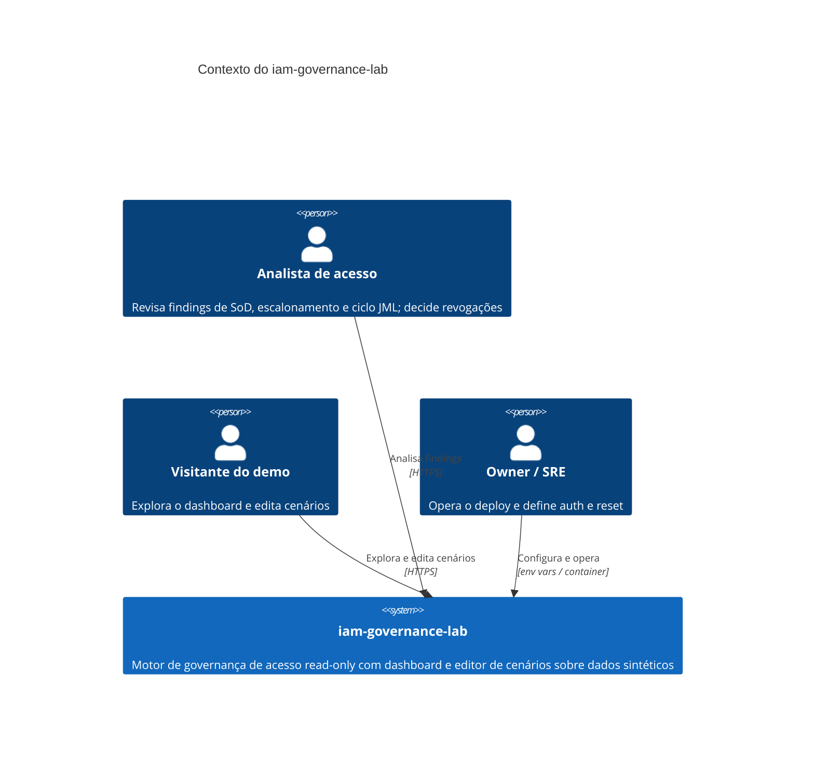
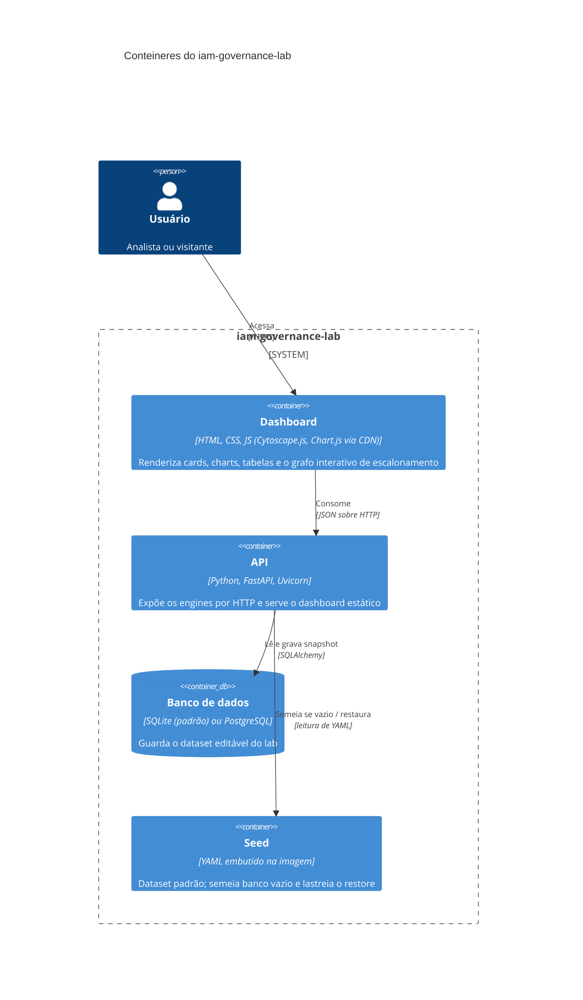
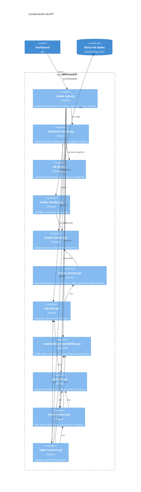
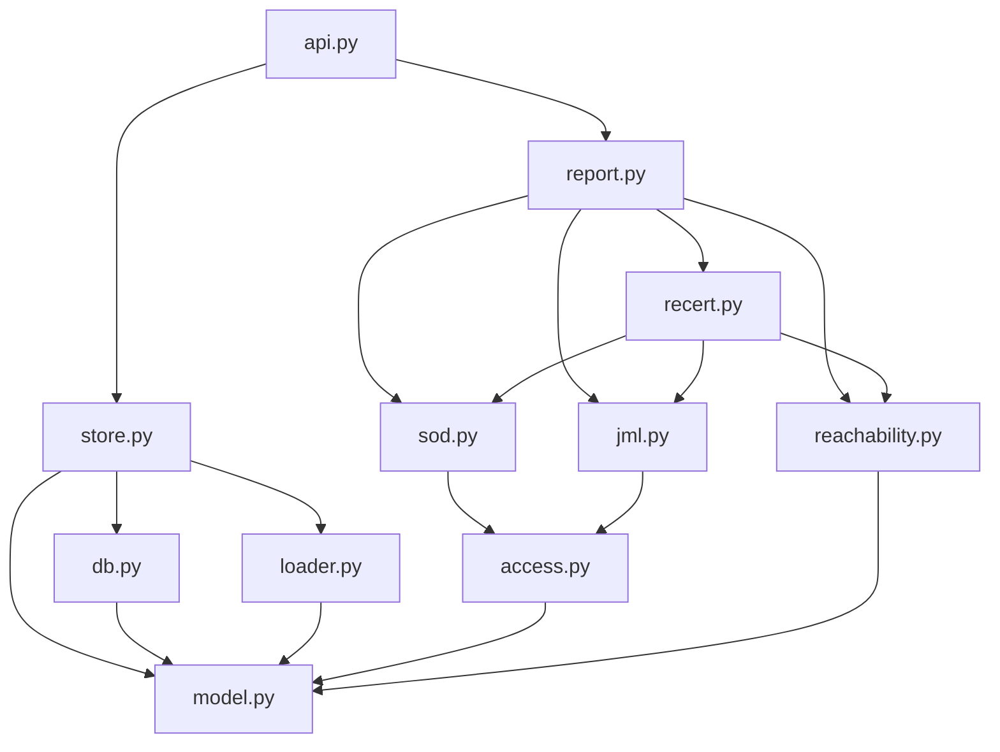
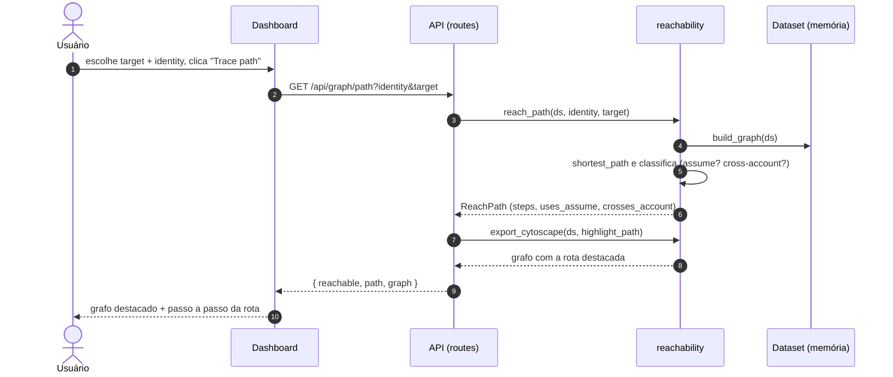
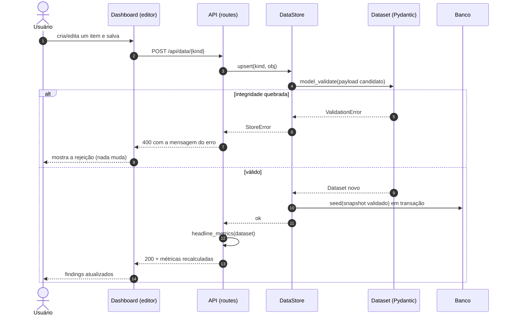
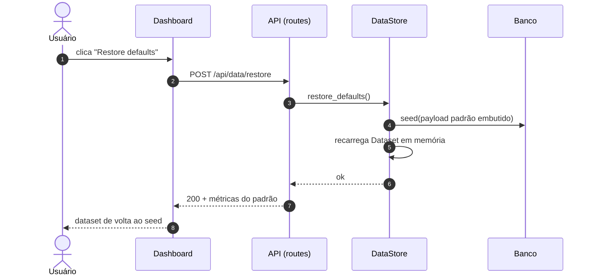
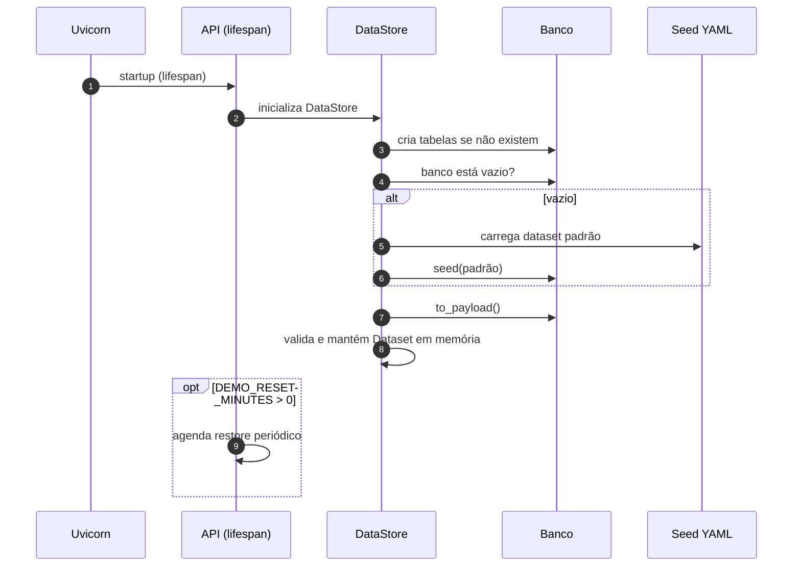

# Arquitetura

Os diagramas seguem o modelo C4 (contexto, contêiner, componente) e diagramas de sequência
para os fluxos principais. Todos estão em Mermaid, versionados junto do código, então mudam
com ele em vez de virar imagem obsoleta.

Princípio que atravessa tudo: a análise é read-only sobre uma fonte de verdade. No lab essa
fonte é um dataset sintético em banco, editável para autoria de cenários; num deployment real,
seria um export read-only de um IdP. O motor nunca escreve no store de identidades real.

## C4 nível 1: contexto

Quem usa o sistema e o que ele é, sem detalhe interno.

## C4 nível 2: contêiner

As peças executáveis e como conversam.

## C4 nível 3: componentes da API

O interior do contêiner de API. As setas são dependências de uso.

Se preferir uma visão só de dependências entre módulos (renderiza em qualquer lugar):

## Sequência: traçar um caminho de escalonamento

O fluxo da joia do projeto. O usuário escolhe um target sensível e uma identity, e o dashboard
desenha a rota no grafo.

## Sequência: editar dado e recalcular

Toda edição revalida o `Dataset` inteiro antes de gravar. Só um snapshot válido chega ao banco.

## Sequência: restore defaults

O mecanismo que garante que o demo público sempre volta a um estado bom.

## Sequência: boot e seed automático

Na primeira subida (banco vazio) o app se semeia sozinho a partir do YAML.

