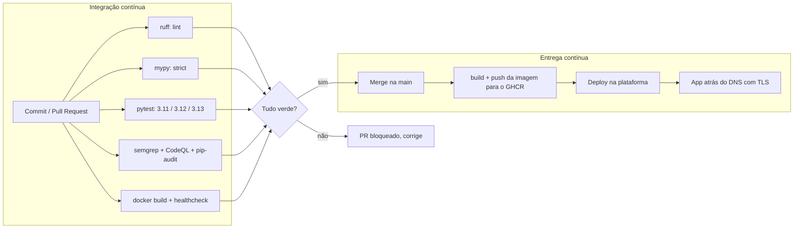

# CI/CD

O ciclo vai do commit até o app rodando num DNS. CI protege a `main` com os quality gates; CD
empacota a imagem e entrega no destino. Tudo declarativo, versionado no repositório.

## Visão do pipeline



## Estágios de CI

Rodam em todo push e todo pull request. Qualquer um vermelho reprova.

| Estágio | Comando | O que protege |
| --- | --- | --- |
| Lint | `ruff check src tests` | Estilo, imports, armadilhas comuns |
| Types | `mypy` (strict) | Contratos de tipo em todo o código |
| Testes | `pytest` em 3.11, 3.12 e 3.13 | Correção dos engines (ground truth) e da API |
| SAST | `semgrep scan` + CodeQL | Padrões inseguros no código-fonte |
| Dependências | `pip-audit --strict` | CVE conhecido em qualquer lib instalada |
| Imagem | `docker build` + `GET /api/health` | Que o container realmente sobe e responde |
| Dataset | `iamgov validate --data data` | Que o seed publicado é íntegro |

Duas frentes de segurança rodam em paralelo aos gates de qualidade. O **Semgrep** roda no job
`security` do `ci.yml` com rulesets públicos do registry, e o **CodeQL** roda no workflow
`codeql.yml`, publicando os achados na aba Security do repositório; ter dois motores de SAST
reduz o ponto cego de cada um. O **pip-audit** falha se alguma dependência tiver CVE conhecido,
e o **Dependabot** (`.github/dependabot.yml`) abre o PR de bump sozinho, para libs Python,
actions do CI e a imagem base do Docker. A política completa está em
[SECURITY.md](../SECURITY.md).

O gate de imagem é importante: um teste verde não garante que o `Dockerfile` empacota tudo e
que o app boota. Subir o container e bater no health fecha essa lacuna.

## Estágios de CD

Rodam só quando a `main` avança.

1. `build + push da imagem`: constrói a imagem e publica no GitHub Container Registry (GHCR),
   com tag `latest` e a tag do SHA do commit, para rastreabilidade.
2. `deploy`: a plataforma de hospedagem puxa a imagem (ou o repositório) e sobe o container.
   No free tier o estado é efêmero e o app se auto-semeia; num plano pago dá para montar um
   disco em `/data` para persistir edições. Ver o blueprint abaixo.
3. `live`: reverse proxy com TLS na frente, respondendo no DNS.

## Deploy: blueprint de plataforma

O jeito mais rápido de ter um DNS público é uma plataforma que entende `Dockerfile` e oferece
disco persistente. O repositório traz um blueprint de Render (`render.yaml`):

```yaml
services:
  - type: web
    name: iam-governance-lab
    runtime: docker
    plan: free
    dockerfilePath: ./Dockerfile
    healthCheckPath: /api/health
    envVars:
      - key: IAMGOV_DB_PATH
        value: /data/iamgov.db
      - key: IAMGOV_DATA_DIR
        value: /app/data
      - key: DEMO_RESET_MINUTES
        value: "60"
```

No free tier não há disco persistente, e o app foi feito para isso: ele se semeia do YAML
embutido a cada start, então o SQLite efêmero sempre volta ao estado padrão. Para um demo
público isso é desejável, o ambiente se autocura. O container escuta na porta que a plataforma
injeta em `PORT` (o `Dockerfile` usa `${PORT:-8000}`), então o mesmo image roda em Render,
Railway, Koyeb ou local sem mudança.

Passo a passo no Render:

1. Conectar o repositório do GitHub.
2. "New" -> "Blueprint"; o Render lê o `render.yaml` e cria o serviço.
3. Aguardar o build do `Dockerfile` e o deploy. O Render entrega um DNS `*.onrender.com`.
4. Para domínio próprio, apontar um CNAME para o host do Render; o TLS é automático.

No Fly.io o caminho equivale: `fly launch` detecta o `Dockerfile`, `fly volumes create` cria o
disco de `/data`, e `fly deploy` sobe. O DNS `*.fly.dev` sai na hora.

## Configuração por ambiente

| Variável | Efeito |
| --- | --- |
| `IAMGOV_DB_PATH` | Caminho do arquivo SQLite (padrão do container: `/data/iamgov.db`) |
| `DATABASE_URL` | URL SQLAlchemy completa; troca SQLite por PostgreSQL |
| `DEMO_RESET_MINUTES` | Se maior que 0, restaura o padrão nesse intervalo (demo se autocura) |
| `IAMGOV_AUTH_USER` / `IAMGOV_AUTH_PASS` | Se ambos setados, exige Basic auth na escrita; leitura fica aberta |
| `IAMGOV_CORS_ORIGINS` | Origens liberadas por CORS (lista por vírgula); vazio libera só same-origin |

## Rollback

A imagem carrega a tag do SHA, então voltar é apontar o deploy para a tag anterior. No free
tier o estado é efêmero e volta ao seed a cada start; num plano com disco em `/data` o estado
persiste no redeploy. Em qualquer caso, se um cenário editado ficar ruim, o botão "Restore
defaults" (ou o reset periódico) recompõe o dataset sem tocar na infra.
