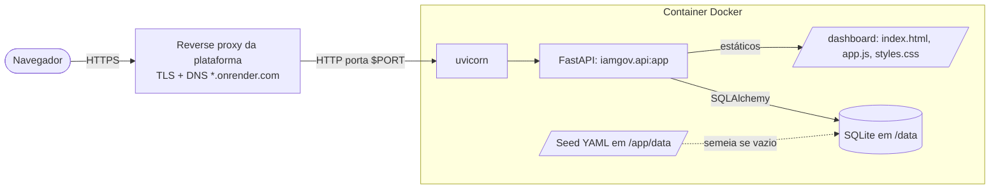
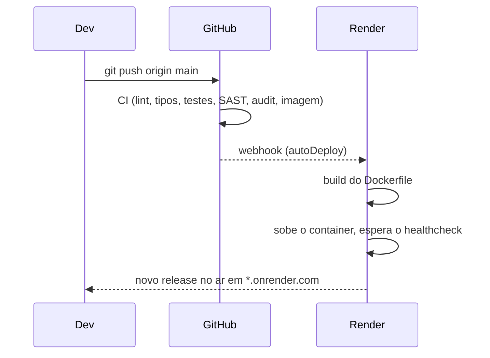

# Deploy

Como o lab sai do repositório e vira um endereço público que qualquer pessoa abre no navegador.
O foco aqui é a topologia e a organização; o ciclo de CI que antecede o deploy está em
[ci-cd.md](ci-cd.md).

## O princípio

Um único artefato roda em qualquer lugar: **uma imagem Docker** que serve a API e o dashboard
no mesmo processo. Nada de build de frontend à parte, nada de servidor de assets separado. O
que muda entre local, Render, Railway ou Koyeb é só a variável de ambiente que a plataforma
injeta; o container é idêntico.

## Topologia em produção



A borda TLS é da plataforma; o container só fala HTTP na porta que recebe em `PORT`. O mesmo
processo Python entrega o JSON da API e os arquivos do dashboard, então não há CORS nem host
cruzado em produção: o front é same-origin com o back.

## O que compõe a imagem

O [`Dockerfile`](../Dockerfile) monta a imagem em camadas pensadas para cache:

1. Instala o pacote a partir de `pyproject.toml` + `src` (a camada que menos muda fica em baixo).
2. Copia o `data/` depois, porque o seed YAML não faz parte do wheel e muda com mais frequência.
3. Cria um usuário sem privilégio (`uid 10001`) e roda como ele, nunca como root.
4. Declara o volume `/data`, expõe a porta e traz um `HEALTHCHECK` que bate em `/api/health`.

O `CMD` sobe `uvicorn iamgov.api:app` na porta `${PORT:-8000}`, em shell form de propósito,
para expandir o `PORT` que a plataforma injeta.

## O caminho do commit até o ar



O deploy é acionado por push na `main`: o `render.yaml` liga `autoDeploy: true`, então cada
commit que passa no CI vira um release novo, sem passo manual. O Render só promove o release
depois de o `healthCheckPath` (`/api/health`) responder 200.

## Como está organizado no Render

O deploy é declarativo, no [`render.yaml`](../render.yaml) versionado no repositório (Blueprint):

- `runtime: docker`, `dockerfilePath: ./Dockerfile`: o Render builda a mesma imagem do CI.
- `plan: free`: sem cartão, sem disco persistente.
- `healthCheckPath: /api/health`: o gate que segura um release quebrado.
- `envVars`: a configuração de ambiente (tabela abaixo).

Subir do zero: **New -> Blueprint**, apontar para o repositório, e o Render lê o `render.yaml`
e cria o serviço. Para domínio próprio, um CNAME para o host do Render; o TLS é automático.

## Configuração por ambiente

| Variável | Padrão no container | Efeito |
| --- | --- | --- |
| `IAMGOV_DATA_DIR` | `/app/data` | Onde está o seed YAML embutido |
| `IAMGOV_DB_PATH` | `/data/iamgov.db` | Caminho do SQLite; use um volume para persistir |
| `DATABASE_URL` | (não setado) | URL SQLAlchemy completa; troca SQLite por PostgreSQL |
| `DEMO_RESET_MINUTES` | `60` no Render | Se maior que 0, restaura o padrão nesse intervalo |
| `IAMGOV_AUTH_USER` / `IAMGOV_AUTH_PASS` | (não setados) | Se ambos setados, exige Basic auth na escrita; leitura fica aberta |

Para manter a **edição só sua** e a leitura pública, defina `IAMGOV_AUTH_USER` e
`IAMGOV_AUTH_PASS` no painel do Render (Environment, com `sync: false`), nunca no arquivo.

## O modelo de estado

O estado é um arquivo SQLite. No free tier não há disco, e o app foi feito para isso: ele se
semeia do YAML embutido a cada start, então o banco efêmero sempre volta ao estado padrão. Num
plano com disco montado em `/data`, as edições sobrevivem ao redeploy. Em qualquer caso, o
botão **Restaurar padrão** do editor (e o reset periódico) recompõe o dataset sem tocar na
infra, então um demo público nunca fica preso num cenário quebrado.

## Rollback

A imagem carrega a tag do SHA do commit (ver o job `publish` no CI), então voltar é apontar o
deploy para a tag anterior, ou usar o "Rollback" do próprio Render para o release anterior.
Como o estado no free tier é efêmero, o rollback de código não arrasta dado nenhum junto.

## Rodar equivalente ao de produção, localmente

```bash
docker compose up --build      # abre http://localhost:8000
```

É a mesma imagem que vai para a plataforma, então o que passa aqui passa no deploy.
